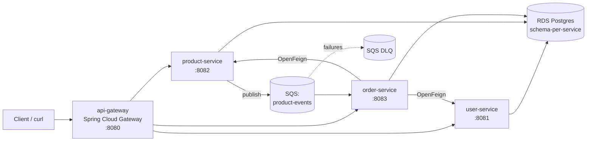

# cncloud — Cloud-Native Microservices on AWS

> **Cloud Information Systems** final project.
> 4 Spring Boot microservices, deployed on AWS with Terraform + Ansible + GitHub
> Actions. Forked from the [Lusófona course template](https://github.com/CLOUD-INFORMATION-SYSTEMS-LUSOFONA/microservices-project)
> and extended into a full cloud-engineering stack.

## What is this

A small e-commerce-ish backend (catalog + orders + users) that exists primarily
as a vehicle to demonstrate the cloud engineering practices required by the
course: networking, IaC, containers, async messaging, persistence, automation,
CI/CD, and IAM hardening.

The application is intentionally small. The engineering around it is the
point.

## Architecture (high-level)



All four services run as Docker containers on a single EC2 host inside a custom
VPC. RDS lives in private subnets; SQS is fully managed; the EC2 has an IAM
instance profile scoped to one queue and one secret.

For the full system diagram + naming conventions + open decisions, see
**[`docs/architecture.md`](docs/architecture.md)**.

## Repository layout

```
microservices-project/
├── README.md                     # this file
├── docs/                         # design docs + operating manuals
│   ├── architecture.md
│   ├── setup.md
│   ├── deployment.md
│   ├── security.md
│   ├── limitations.md
│   └── reuse-map.md              # audit of the per-week labs
├── api-gateway/                  # Spring Cloud Gateway, :8080
├── user-service/                 # :8081
├── product-service/              # :8082, SQS publisher
├── order-service/                # :8083, SQS consumer + OpenFeign
├── docker-compose.yml            # local dev (with Kafka)
├── docker-compose.aws.yml        # production (no Kafka, IAM profile)
├── Makefile                      # package / images / push / deploy / tf-*
├── infrastructure/
│   ├── bootstrap/                # one-shot: S3 state + DynamoDB + billing + OIDC
│   └── terraform/
│       ├── modules/{vpc,compute,db,queue}/
│       └── environments/dev/
├── ansible/
│   ├── inventory/aws_ec2.yml     # dynamic, filters by tag:Project+Environment
│   ├── roles/docker/             # idempotent Docker install
│   └── playbooks/
│       ├── sanity-test.yml       # hello-world end-to-end check
│       └── deploy-app.yml        # reads RDS secret, renders .env, compose up
└── .github/workflows/
    ├── aws-smoke.yml             # validates OIDC end-to-end
    ├── ci.yml                    # PR: build matrix + terraform plan + comment
    └── deploy.yml                # main: build/push + tf apply + ansible deploy
```

## Quick start

**One-time per AWS account** (creates remote state, billing alarms, OIDC):
```bash
cd infrastructure/bootstrap
cp terraform.tfvars.example terraform.tfvars   # edit values
terraform init && terraform apply
```

**Then in CI**: push to `main` → workflow `deploy.yml` builds the 4 images,
runs `terraform apply` (gated by approval), and `ansible-playbook deploy-app.yml`.

**Or manually from your laptop**:
```bash
# 1. Provision (~5 min)
make tf-apply

# 2. Build, push, deploy (~10 min)
make ship           # mvn clean package + docker buildx + push (all 4)
make deploy         # ansible reads RDS secret, renders .env, force-recreate

# 3. Validate
curl http://$(make tf-ec2-ip):8080/api/products
```

Step-by-step instructions, prerequisites, and troubleshooting in
**[`docs/setup.md`](docs/setup.md)** and **[`docs/deployment.md`](docs/deployment.md)**.

## What the mandatory requirements map to

| # | Requirement | Where it lives |
|---|---|---|
| 1 | Cloud infrastructure | `infrastructure/terraform/modules/vpc/` |
| 2 | Infrastructure as Code | All of `infrastructure/terraform/` + bootstrap |
| 3 | Containerization | `*/Dockerfile` + Docker Hub `dhirennn/cncloud-*` |
| 4 | Distributed architecture | 4 services, gateway, OpenFeign + SQS |
| 5 | Event-driven communication | `product-service` publishes, `order-service` consumes, DLQ |
| 6 | Persistence | RDS Postgres, schema-per-service via `default_schema` + `create_namespaces` |
| 7 | Automation | `ansible/` (dynamic inventory + roles + playbooks) |
| 8 | CI/CD | `.github/workflows/{ci,deploy}.yml` with OIDC + GHA cache |
| 9 | Security & IAM | OIDC instead of static keys; least-priv role; Secrets Manager |

## Status & limitations

Known issues and tradeoffs in **[`docs/limitations.md`](docs/limitations.md)**.
Most notable:

- `ProductEventSqsPublisherTest` doesn't compile cleanly on CI → tests are
  skipped in CI builds. Functional SQS validation still works end-to-end.
- Spring Boot startup is ~50 s on t3.small (was 11 min on t3.micro before
  switching). Acceptable for a dev environment.
- Kafka is kept only in `docker-compose.yml` for local dev. The AWS path
  uses SQS.

## Tearing down

```bash
# Application stack:
cd infrastructure/terraform/environments/dev && terraform destroy

# Bootstrap (only when retiring the account):
cd infrastructure/bootstrap && terraform destroy
# (the S3 state bucket has prevent_destroy=true — remove that flag first)
```

Cost estimate: ~$8-15/mo if you leave the stack running (EC2 t3.small + RDS
db.t3.micro). Less than $1 if you `terraform destroy` at end of day.
