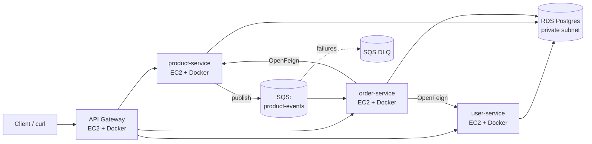

# Architecture

> Status: **draft** — Day 1. Diagrams will evolve as infrastructure is implemented.

## One-paragraph pitch

A cloud-native microservices system deployed on AWS, built on a Spring Boot
microservices template. It demonstrates the full cloud engineering stack
explored in the course: VPC networking, EC2 compute, RDS persistence,
SQS asynchronous communication, IaC with Terraform modules, configuration
management with Ansible, and CI/CD with GitHub Actions using OIDC to AWS.
The application is intentionally simple (catalog + orders + async event
flow) so the focus stays on the engineering practices around it.

## Service inventory

| Service          | Port | Responsibility                            | Persistence |
|------------------|------|-------------------------------------------|-------------|
| `api-gateway`    | 8080 | Single entry point, Spring Cloud Gateway  | —           |
| `user-service`   | 8081 | User CRUD                                 | RDS Postgres |
| `product-service`| 8082 | Catalog; publishes `ProductCreated` to SQS| RDS Postgres |
| `order-service`  | 8083 | Orders; consumes SQS; calls user+product via OpenFeign | RDS Postgres |

## High-level architecture (target)



## AWS layout (target)

- **Region:** `us-east-1`
- **VPC:** custom, CIDR `10.0.0.0/16`, across 2 AZs (`us-east-1a`, `us-east-1b`)
- **Subnets:**
  - Public (`10.0.1.0/24`, `10.0.2.0/24`) — EC2 hosting containers, ALB (if used)
  - Private (`10.0.10.0/24`, `10.0.20.0/24`) — RDS, internal-only resources
- **Security groups:**
  - `web-sg` — inbound 80/8080 from `0.0.0.0/0`
  - `app-sg` — inbound 8081/8082/8083 from `web-sg` only
  - `db-sg` — inbound 5432 from `app-sg` only
- **SQS:**
  - `cncloud-dev-product-events` (standard, long-polling, visibility 60s)
  - `cncloud-dev-product-events-dlq` (DLQ, maxReceiveCount=3)
- **RDS:** Postgres 16, `db.t3.micro`, in private subnets, single-AZ in dev, password via Secrets Manager

## Naming & tagging convention

- **Resource prefix:** `cncloud-{env}-{resource}` (e.g. `cncloud-dev-vpc`)
- **Branch prefixes:** `feat/`, `fix/`, `infra/`, `docs/`
- **Common tags on every AWS resource:**
  ```hcl
  tags = {
    Project     = "cncloud"
    Environment = "dev"
    ManagedBy   = "terraform"
    Owner       = "team"
  }
  ```

## Repository structure

```
microservices-project/
├── README.md
├── docs/                       # Documentation + diagrams
│   ├── architecture.md         # This file
│   ├── setup.md
│   ├── deployment.md
│   ├── security.md
│   └── limitations.md
├── api-gateway/                # Spring Boot service
├── user-service/               # Spring Boot service
├── product-service/            # Spring Boot service, SQS producer
├── order-service/              # Spring Boot service, SQS consumer
├── docker-compose.yml          # Local dev: Kafka + 4 services
├── infrastructure/
│   ├── bootstrap/              # One-shot: S3 backend + DynamoDB lock table
│   └── terraform/
│       ├── modules/{vpc,compute,db,queue}/
│       └── environments/{dev,prod}/
├── ansible/
│   ├── playbooks/              # configure-ec2, deploy-app
│   ├── roles/                  # docker-install, app-deploy
│   ├── inventory/              # aws_ec2 dynamic inventory
│   └── group_vars/             # per-env config
└── .github/
    └── workflows/              # ci.yml + deploy.yml
```

## Decisions (Day 1)

| Decision | Choice | Rationale |
|---|---|---|
| AWS region | `us-east-1` | Reuse existing key pair and SQS knowledge from week6/week9; cheapest region in many service tiers. |
| Resource prefix | `cncloud-{env}-{resource}` | Consistent across Terraform, AWS resources, tags. |
| VPC CIDR | `10.0.0.0/16` | Same as week5/7/8 labs. |
| Public subnets | `10.0.1.0/24`, `10.0.2.0/24` (2 AZs) | From week8 module. |
| Private subnets | `10.0.10.0/24`, `10.0.20.0/24` (2 AZs) | RDS only; no internet egress needed. |
| **NAT Gateway** | **None** | Same approach as labs (week5/7/8). Saves ~$30/mo. Private subnets host RDS only. |
| EC2 count (dev) | **1× t3.micro** | All containers via docker-compose on a single host. Cheap, simple to demo. Can scale up for prod later. |
| EC2 AMI | Latest Amazon Linux 2 | Has Python preinstalled (Ansible-friendly), free tier. |
| SSH key pair | Reuse existing `week6-key` | Already in AWS; PEM file local. Terraform references by name. |
| RDS engine | Postgres 17 db.t3.micro | Carry from week7 rds.tf. Single-AZ in dev, encryption ON. |
| RDS password | Secrets Manager (NOT tfvars) | Never commit secrets. App reads via IAM-scoped read access. |
| Kafka in AWS? | **No** | Kafka only in local docker-compose for dev. Production async path uses SQS. Simplifies defense. |
| SQS variant | **Standard only** (no FIFO) | Standard + DLQ covers Lab9 requirements. FIFO would be extra complexity to justify. |
| Billing alarm | Terraform-managed (port from week1 CFN) | Consistency: everything in Terraform. |
| Container registry | Docker Hub (`dhirennn/*`) | Already used in week6 deploy-container.sh and week10 deploy-app.yml. |
| ALB? | Not in MVP | Optional stretch goal if time allows. |

## Changelog of this document

- _Day 1_ — initial draft (service inventory, target AWS layout, naming, repo structure)
